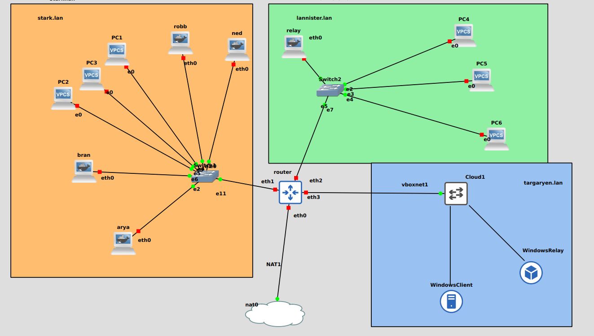

# Configuración de Servidor DNS e DHCP
---

## Esquema de rede

---

## Servidor DNS
O equipo **arya** será o servidor DNS para os dominios:
- `stark.lan`
- `lannister.lan`
- `targaryen.lan`

---

## Instalación e Configuración do Servidor DHCP en *ned* (Debian)

### Router (Relay DHCP)
O equipo **router** actuará como *DHCP relay* e terá a seguinte configuración de rede:

- **eth0 → WAN**
- **eth1 (rede stark)**  
  Enderezos: `192.168.10.252`, `192.168.10.253`, `192.168.10.254`
- **eth2 (rede lannister)**  
  Enderezo: `192.168.11.254`
- **eth3 (rede targaryen)**  
  Enderezo: `192.168.12.254`

---

## Subredes DHCP

### 1. Rede **stark.lan** — `192.168.10.0/24`
Configuraranse **dous pools**:

#### Pool 1
- Rango: `192.168.10.30` – `192.168.10.32`
- Router para clientes: `192.168.10.253`
- Dominio de busca: `stark.lan`

##### Reserva estática
Para o equipo **bran**, incluído dentro deste primeiro pool:
- Router asignado: `192.168.10.252`

#### Pool 2
- Rango: `192.168.10.101` – `192.168.10.230`
- Router para clientes: `192.168.10.254`
- Dominio de busca: `stark.lan`

---

### 2. Rede **lannister.lan** — `192.168.11.0/24`
- Router: `192.168.11.254`  
- Dominio de busca: `lannister.lan`

---

### 3. Rede **targaryen.lan** — `192.168.12.0/24`
(Conectada ao interface `tap0` de VirtualBox)

- Router: `192.168.12.254`  
- Dominio de busca: `targaryen.lan`

---

## Parámetros comúns a todas as redes
- **Servidor DNS:** o equipo **arya**
- **Servidor NTP:** `rnp.roa.es`
- **Arquivo de log:** `/var/log/dhcp.log`
- O servidor DHCP debe **actualizar mediante chaves** as zonas primaria directa e inversa no servidor DNS arya.

---

## Clientes necesarios
- Rede **stark**: `bran`, `jon`, `sansha` (mínimo 3; recoméndanse 4)
- Rede **lannister**: `jamie`
- Rede **targaryen**: `daenerys`

---

## Repositorio base
Podes empregar o seguinte repositorio como punto de partida:

**Esqueleto dun servidor DHCP con Kea:**  
https://github.com/brunosct/dhcp-skel-2025.git
